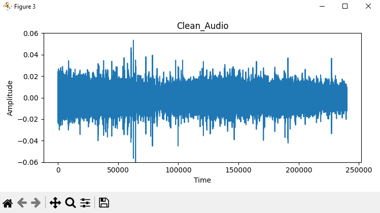
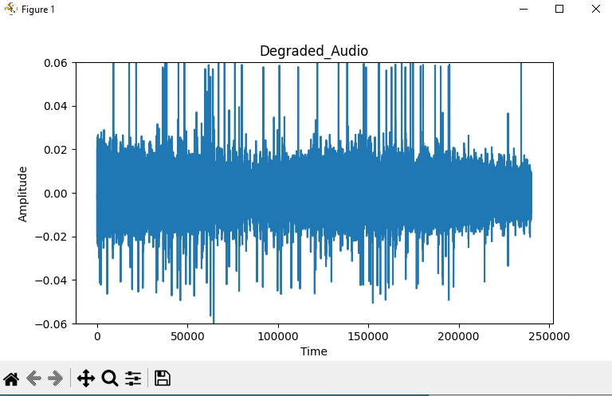
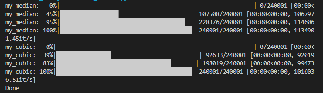

# Audio Restoration by Median Filter and Cubic Splines Interpolation in Python

## High-level Description of the project
This assignment II builds on assignment I. We assume that we have successfully detected the clicks and we are applying two different interpolation methods to restore the audio: meidian filtering and cubic splines interpolation, and these two methods both get a good effect on noise removal and audio restoration, however, there are differences in the processing principles and operating structures of the two, which also cause some gaps in the effects obtained by the two different methods.   
- Median Filtering

The median filter is a non-linear digital filtering technique, often used to remove noise from an image or signal. Such noise reduction is a typical pre-processing step to improve the results of later processing (for example, edge detection on an image). Median filtering is very widely used in digital image processing because, under certain conditions, it preserves edges while removing noise (but see the discussion below), also having applications in signal processing.

- Cubic Splines Interpolation

Cubic spline interpolation is a way of finding a curve that connects data points with a degree of three or less. Splines are polynomial that are smooth and continuous across a given plot and also continuous first and second derivatives where they join.


---

## Installation and Execution
Provide details on the Python version and libraries (e.g. numpy version) you are using. One easy way to do it is to do that automatically:
```sh  
autopep8==2.0.0
certifi==2022.9.24
charset-normalizer==2.1.1
colorama==0.4.6
contourpy==1.0.6
cycler==0.11.0
docopt==0.6.2
fonttools==4.38.0
idna==3.4
kiwisolver==1.4.4
matplotlib==3.6.2
numpy==1.23.5
packaging==21.3
Pillow==9.3.0
pipreqs==0.4.11
playsound==1.2.2
pycodestyle==2.10.0
pydub==0.25.1
pyparsing==3.0.9
python-dateutil==2.8.2
requests==2.28.1
scipy==1.9.3
six==1.16.0
tomli==2.0.1
tqdm==4.64.1
urllib3==1.26.13
yarg==0.1.9
```
The link to this public github repository is shown below:
```sh
https://github.com/RyanLee5418/Computational_Project.git
```
---

## Methodology and Results
This code be divided into three important parts: as2_median funciton(main function), my_median function and my_cubic function.

The as2_median funciton is the main function of the project, in which reads the degraded.wav audio file and detectionfile.wav file for the two restoration functions. In the main function, the degraded audio and detection file gets into the my_median function and my_cubic function in order, to get the clicks of the degraded audio removed and restore the signal to get close to the clean audio.

The my_median function is the median filter I make for the median filtering of the degraded audio. In this function, there are some while loop, for loop and if judgement, and the length of the median filter window is decided by the different number of the continuously clicks, so that it can achieve the ideal effect to restore the audio.

The my_cubic function is the cubic splines interpolation I make for the cubic splines implementation for audio restoration. In this function, several while loops are used, and I use the detection file to determine the clicks positions and then remove these clicks and combine the new lists, then by using the cubic spline function and splinespace function to implement the cubic splines interpolation for audio restoration.    

There is a unittesting included in the main function, this unittesting compare the length of the restored wav audio file with the one of clean wav audio file.


**Results**

1. About the original clean audio<clean.wav> and degraded audio file<degraded.wav>, the amplitude and time graphs are shown below:

<div align = center>



<div align = left >
We can see some clicks are add into the clean audio file, which makes the audio noisy and messy. To remove those clicks and restore the audio file to the original clean version audio. 

2. For the median filter in this code, different lengths of the median filter are used according to the different number of the continuously clicks. The restored waveform <output_medianFilter.wav> of the median filter is given below:

<div align = center>
<div align = left >
As we can see, the restored audio by median filter gets a good result of noise removal and interpolation, and the outpur audio file is get a good close to the clean audio.

3. Using the cubic splines, we observe that the cubic splines interpolation gives a good effect on the clicks removal and audio signal restoration. The restored waveform <output_cubicSplines.wav> with the optimal filter length is given below:

<div align = center>
<div align = left >
In the graph, we can clearly get the point: the result of the cubic splines interpolation is very similar to the result of the median filter. And it may be difficult to recognize the difference between the two methods. But they do get a good effects of restoration.  

4. Comparing the two different interpolation methods, we notice that the cubic splines interpolation achieves a lower MSE. And the runtime of cubic splines method is also lower than the median filter. The MSE comparation of the two different methods is given in the figure below: 

<div align = center>
<div align = left >
The runtime of the median filtering and cubic splines interpolation is shown in the figure below: 

<div align = center>
<div align = left >
After listening to the two restored files, we notice both of them get a good effects on clicks removal and audio restoration, the clicks in the degraded audio file were well removed. But the cubic splines method is the better one for this audio restoration.

---
## Credits

This code was developed for purely academic purposes by RyanLee5418 as part of the module.

Resources:
- https://pythonnumericalmethods.berkeley.edu/notebooks/chapter17.03-Cubic-Spline-Interpolation.html


